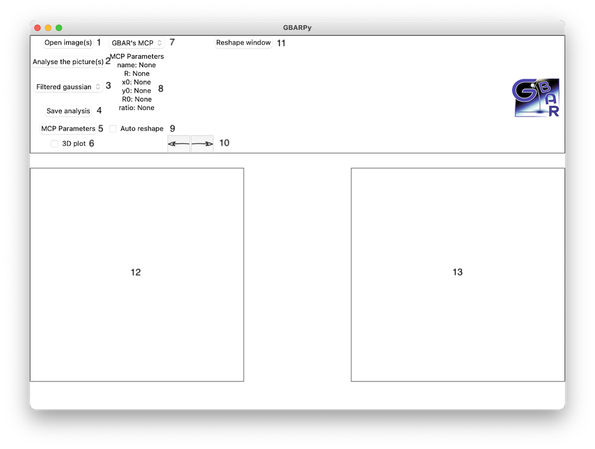
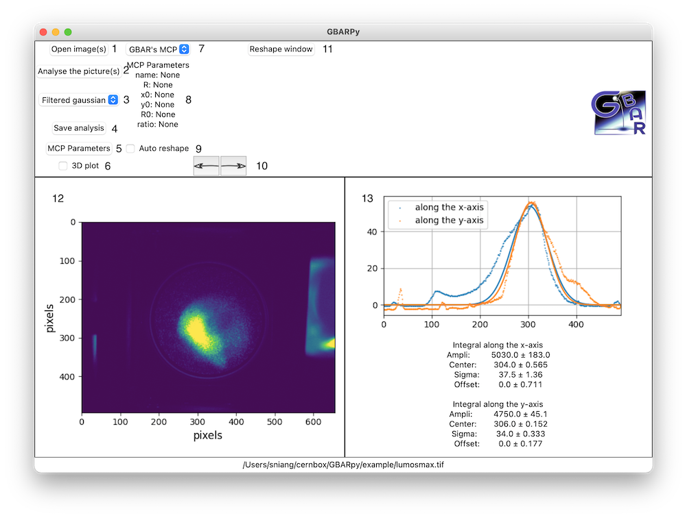
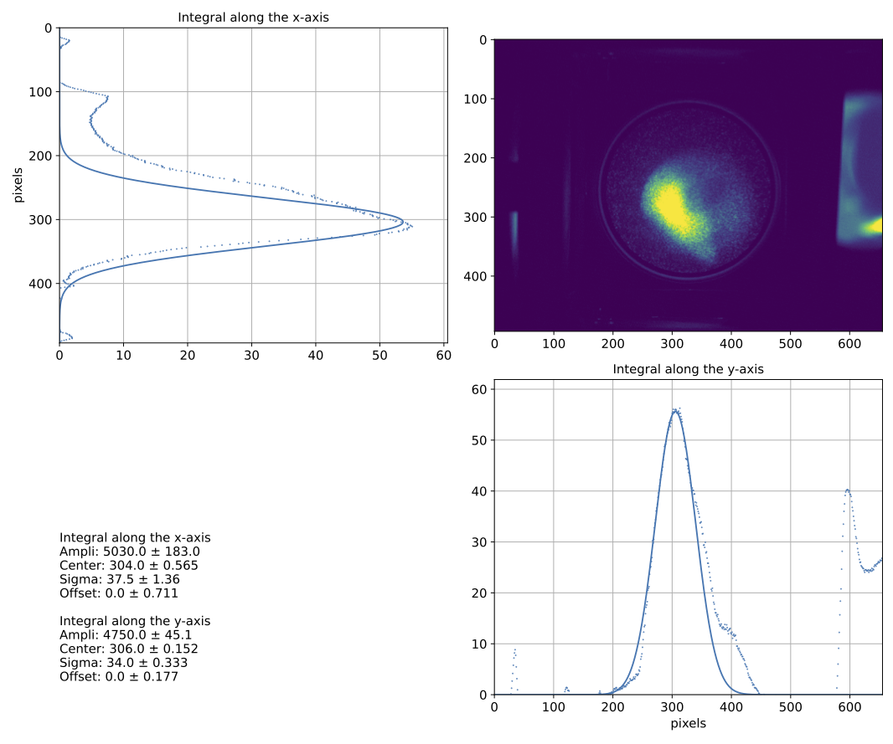
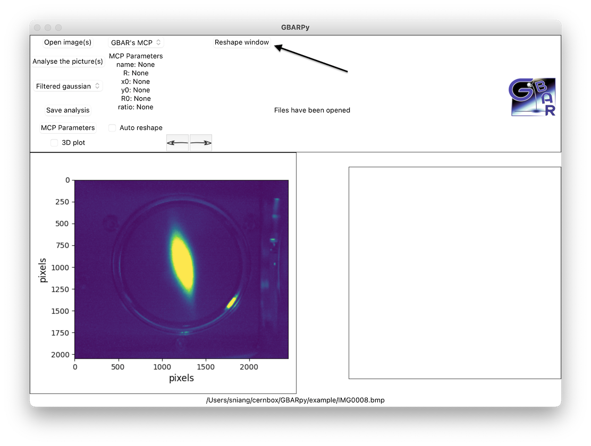
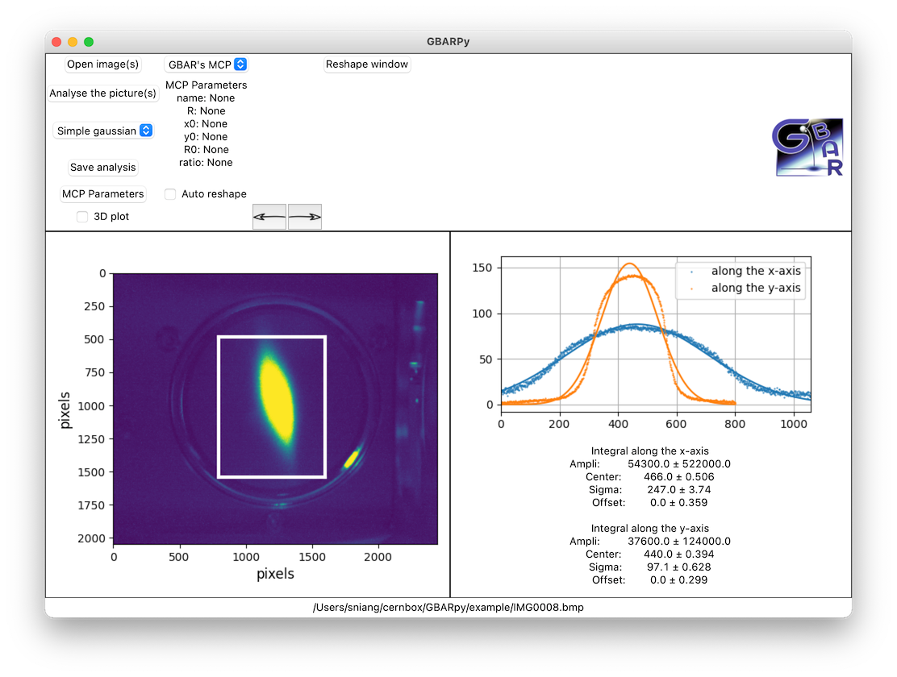
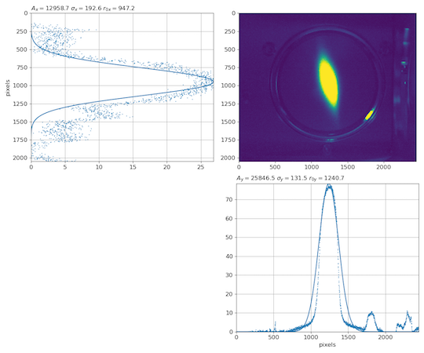

# GBARpy manual

This library is made to work with python 3.
## Table of Contents
* [Installation](#installation)
    * [Procedure for Unix and MacOS](#procedure-for-unix-and-macos)
    * [Procedure for Windows](#procedure-for-windows)
* [Graphical User Interface](#graphical-user-interface)
    * [How to do an analysis](#how-to-do-an-analysis)
    * [Set the MCP parameters](#set-the-mcp-parameters)
    * [Reshape the pictures](#reshape-the-pictures)
* [MCPpicture library](#mcppicture-library)
    * [Basic code for an analysis](#basic-code-for-an-analysis)
    * [More examples](#more-examples)
    * [BeamSpot class](#beamspot-class)
        * [Attributes](#attributes)
        * [Methods](#methods)

## Installation
### Procedure for Unix and MacOS
1. Install [python 3](https://www.python.org/downloads/)
2. Check if pip is installed by entrering in the terminal
    ```
    python3 -m pip -V
    ```
    This command will give you the version of pip already installed. If not, [install it](https://pip.pypa.io/en/stable/installing/)
3. Install GBARpy
    ```
    python3 -m pip install GBARpy
    ```
4. Lauch GBARpy
    ```
    python3 -m GBARpy
    ```
If in the future, you need to update the version of GBARpy
```
python3 -m pip install --upgrade GBARpy
```
or to remove GBARpy
```
python3 -m pip uninstall GBARpy
```
### Procedure for Windows
1. Install [python 3](https://www.python.org/downloads/)
2. Check if pip is installed by entrering in the command prompt
    ```
    py -m pip -V
    ```
    This command will give you the version of pip already installed. If not, [install it](https://pip.pypa.io/en/stable/installing/)
3. Install GBARpy
    ```
    py -m pip install GBARpy
    ```
4. Lauch GBARpy
    ```
    py -m GBARpy
    ```
If in the future, you need to update the version of GBARpy
```
py -m pip install --upgrade GBARpy
```
or to remove GBARpy
```
py -m pip uninstall GBARpy
```
## Graphical User Interface
### How to do an analysis
[GUI_1](example/GUI_1.png)



1. Button to open an MCP picture.
2. Button to analyse the opened picture. 
    If no picture has been opened, a dialog window will appears to invite you to open one.
3. To select the kind of fit.
4. To save as an image the result of the analysis. 
    If no picture has been opened, a dialog window will appears to invite you to open one.
5. Button to open the window to [set the MCP parameters](#set-the-mcp-parameters).
6. To show the original picture as a 3D plot
7. To select an already recorded GBAR's MCP parameter set.
8. The MCP parameters one they have been [set](#set-the-mcp-parameters).
9. To reshapoe automatically the pictures according to the MCP parameters.
10. Arrows to switch between pictures.
11. Button to open the window to [reshape the pictures](#reshape-the-pictures).
12. The opened picture.
13. The result of the analysis.

[GUI_2](example/GUI_2.png)


[GUI_3](example/GUI_3.png)



[GUI_4](example/GUI_4.png)



### Set the MCP parameters
The different parameters are
* Name: the name of your MCP
* R: the radius of the phosphore screen in mm (to define in the end the ratio mm/pixels)
* x0: the x position of the center of the phosphore screen (in pixels)
* y0: the y position of the center of the phosphore screen (in pixels)
* R0: the radius of the phosphore screen in pixels (to define in the end the ratio mm/pixels)
* ratio: the mm/pixels ratio; if R and R0 are defined, the ratio is automatically defined (ratio = R/R0)

To try the setting of the parameters, you can use the picture [lumosmax.tif](example/lumosmax.tif) and the parameter file [BGT_in.mcp](example/BGT_in.mcp). It is obviously better to have a picture where the border of your MCP are clearly visible to be able to set the parameters. In the future, a tool will be developped the find more easily these parameters.

[GUI_5](example/GUI_5.png)


The window posses 4 buttons:
* Set: to set the parameters and use them in the future analysis
* Save: to save the parameters as a binary file (.mcp) to be able to use the parameters during a future session
* Load: to import the parameters from a binary file previously created (.mcp file)
* Remove: to empty the form

Be careful: if you do not press the "set" buttons and close the MCP parameter windows, what you filled in the form is lost. On the contrary, pressing "remove" by accident is not a problem if you didn't press "set", in that case, close and re-open the window.

[GUI_6](example/GUI_6.png)


One ce parameters has been set, press "Analyse the picture". If "ratio" has been set, then the pixels are converted in mm. If all the parameters are set, then the border of your phosphore screen will be draw. In the future, these parameters will be used to improve the fitting of the pictures.

### Reshape the pictures
[reshape_1](example/reshape/reshape_1.png)



[reshape_2](example/reshape/reshape_2.png)


[reshape_3](example/reshape/reshape_3.png)




## MCPpicture library

All the classes and the methods in this library are presented [here](MCPPicture_doc.md).

### Basic code for an analysis
The examples corresponds to the python scripts [MCP_example_basic.py](example/MCP_example_basic.py) and [MCP_example_small_functions.py](example/MCP_example_small_functions.py).

```python
# Import the library
import GBARpy.MCPPicture as mcp
import matplotlib.pyplot as plt
```
Let's see how to import a beam spot picture (you can try with the file [IMG0008.bmp](example/IMG0008.bmp)):
```python
# reshape analyse the beam spot
pic = mcp.BeamSpot("IMG0008.bmp",reshape=[1250,1000,600])
# the reshape array is a made of 3 elements: positionX, positionY, length (in pixel)
# if you don't want to reshape
pic = mcp.BeamSpot("IMG0008.bmp")
```
With this minimal code, the picture is analysed and the parameters of the fit can be obtained usign ```print(img)```.
If it then possible to see and save the pictures as in the following example:
```python
#plot the image
fig1 = plt.figure(figsize=(5,5))
plt.imshow(pic.img)
fig1.savefig("fig_example_1.pdf")
```
[Example_1](example/fig_example_1.png)


Even if it can be written manually, there are line codes to plot the intgrals along the x-axis and the y-axis:
```python
#plot the fit
fig2 = plt.figure(figsize=(5,5))
pic.plot_X_int()
pic.plot_Y_int()
fig2.savefig("fig_example_2.pdf")
```
[Example_2](example/fig_example_2.png)


or to plot a summary of the fit:
```python
#plot all
pic.plot("fig_example_3.pdf")
```
[Example_3](example/fig_example_3.png)



### More examples
To import the required librairies for the following examples:
```python
# Import the library
import GBARpy.MCPPicture as mcp
import matplotlib.pyplot as plt
```

For some reasons, you might desire to import the picture without analysing it:
```python
### Import the Picture
img = mcp.import_image("IMG0008.bmp")
fig4 = plt.figure(figsize=(5,5))
plt.imshow(img)
fig4.savefig("fig_example_4.png")
```
[Example_4](example/fig_example_4.png)


```python
### Import the Picture and reshape
img = mcp.import_image("IMG0008.bmp",reshape=[1250,1000,600])
fig5 = plt.figure(figsize=(5,5))
plt.imshow(img)
fig5.savefig("fig_example_5.png")
```
[Example_5](example/fig_example_5.png)


Once the pictures imported as a 2D array, it it possible to get the integrals along the x or y axis
```python
### Integrals along the X and Y axis
Px,Ix = mcp.integrate_picture_along_X(img)
Py,Iy = mcp.integrate_picture_along_Y(img)
fig6 = plt.figure(figsize=(10,5))
plt.subplot(121)
plt.imshow(img)
plt.subplot(122)
plt.plot(Px,Ix)
plt.plot(Py,Iy)
fig6.savefig("fig_example_6.png")
```
[Example_6](example/fig_example_6.png)


and then, using the fit function defined in the library
```python
### Fit of the integrals
poptX,perrX=mcp.fit_gaussian_offset_filtered(Px,Ix)
poptY,perrY=mcp.fit_gaussian_offset_filtered(Py,Iy)
fig7 = plt.figure(figsize=(5,5))
plt.plot(Px,Ix,'.',color='tab:red',ms=1)
plt.plot(Px,mcp.gaussian_offset(Px,*poptX),color='tab:red')
plt.plot(Py,Iy,'.',color='tab:blue',ms=1)
plt.plot(Py,mcp.gaussian_offset(Py,*poptY),color='tab:blue')
fig7.savefig("fig_example_7.png")
```
[Example_7](example/fig_example_7.png)


### BeamSpot class
```class MCPPicture.BeamSpot(fname, reshape=[], mcpp=None, fit='Filtered gaussian')```

[source][https://github.com/sniang/GBARpy/tree/main/src/GBARpy/MCPPicture.py#L22]

Class to analyse the pictures coming from the MCP.
#### Attributes
* fname: str  
file name of the picture.
* img: float[float[]]  
* picture as an array.
pix: int[]  
* the pixels along the x axis.
piy: int[]  
* the pixels along the y axis.
* Ix: float[]  
integral along the x axis.
* Iy: float[]  
integral along the y axis.
* total_integral: float  
Total integral pf the image.
* poptx: float[]  
the parameters of the fit along the x-axis.
* perrx: float[]  
errors on the parameters of the fit along the x-axis.
* popty: float[]  
the parameters of the fit along the y-axis.
* perry: float[]  
errors on the parameters of the fit along the y-axis.
* reshape: int[]  
the parameters to reshape, see help(import_image).
* Fit: GBARpy.MCPPicture.FitInterface  
The fit used for the analysis.
### Parameters
*fname : str  
    file name of the picture. The accepted file format["tif","jpg","jpeg","png","asc","bmp"].
* reshape : int[3] or int[4]  
    [ix,iy,l] to reshape the picture as a square
    or [x1,x2,y1,y2] to reshape as a rectangle.
* fit : str  
    The kind of fit. Choose between "Filtered gaussian", "Simple gaussian", "Two gaussians".
### Example
```python
import GBARpy.MCPPicture as mcp
bs = mcp.BeamSpot("name.tif")
```
#### Methods
```__repr__(self)```:
To represent the object as a string
* Returns
    * a string variable
* Example
    ```python
    import GBARpy.MCPPicture as mcp
    bs = mcp.BeamSpot("name.tif")
    repr = bs.__repr__()
    #or to print it in the python console
    print(bs)
    ```

``` plot_Y_int(self,label="")```:
To plot the integral of the picture along the "y" axis
* Parameters
    * label: (optional) a string
* Example
    ```python
    import GBARpy.MCPPicture as mcp
    bs = mcp.BeamSpot("name.tif")
    bs.plot_Y_int("Integral along the y-axis")
    ```

```plot_X_int(self,label="")```:
To plot the integral of the picture along the "x" axis
* Parameters
    * label: (optional) a string
* Example
    ```python
    import GBARpy.MCPPicture as mcp
    bs = mcp.BeamSpot("name.tif")
    bs.plot_X_int("Integral along the x-axis")
    ```
    
```plot_X_int_revert(self)```:
To plot the integral of the picture along the "x" axis and reverse the picture
*  Example
    ```python
    import GBARpy.MCPPicture as mcp
    bs = mcp.BeamSpot("name.tif")
    bs.plot_X_int("Integral along the x-axis")
    ```

```plot(self,fname="",figsize=(12,10),fontsize=12,ftsizeticks=12)```:
To plot the picture and the analysis
*  Parameters
    * fname: string (optional), the name of the file to save the plot
    * figsize: tuple (size in inch X, Y) (optional), size of the figure
    * fontsize: int (optional), size of the font
    * ftsizeticks: int (optional), size of the ticks' font
* Returns
    * fig: a matplotlib.pyplot.figure
* Example
    ```python
    import GBARpy.MCPPicture as mcp
    bs = mcp.BeamSpot("name.tif")
    fig = bs.plot("analysis.pdf")
    # or
    fig = bs.plot()
    fig.savefig("analysis.pdf")
    ```
